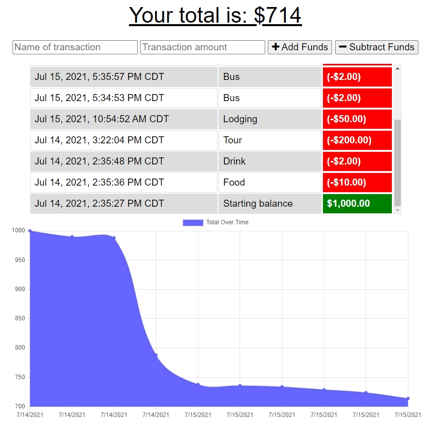

# PWA Online/Offline Budget Trackers

## Licensing:

#### Table of Contents
1. [Description](#description)
2. [Installation](#installation)
3. [Usage](#usage)
4. [Contributing](#contributing)
5. [Tests](#tests)
6. [Links](#links)
7. [Questions](#questions)

## Description
PWA website to add and view your budget transactions, provides offline access and functionality.

## Installation
nodeJS  
MongoDB (if use locally)  
npm install    
npm start

## Usage
1. Download repository.
2. Open PowerShell/Bash, navigate in PowerShell/Bash into the downloaded repository folder.
3. Run "npm install", then "npm start" or "node server.js".

## Contributing
This is open source project. Feel free to contribute😊.  

## Tests
Run "npm start" or "node server.js" in the PowerShell/Bash.

## Screenshot(s)
  

## Links
Live/Production = https://budgetrackersc3.herokuapp.com/  
  

Repository = https://github.com/CrisC3/PwaBudgetTrackers  

## Questions
For any questions, you can contact:  
Github = https://github.com/CrisC3  
Email  = Cristobal.Canales@gmail.com